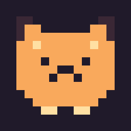

<p align="center">
  
</p>

<h1 align="center">Macmagotchi</h1>

<p align="center">A virtual pixel pet for your macOS menu bar.</p>

## Description

Macmagotchi is a small menu bar pet that stays out of your way. Check on it, feed it, play with it, let it sleep, or pet it while you work. It can also walk along the bottom of your desktop.

- **Requires:** macOS 14+
- **Built with:** Swift 6, SwiftUI, AppKit
- **Data:** `~/Library/Application Support/Macmagotchi/pet.json`

## Build

### Xcode

1. Open `Macmagotchi.xcodeproj`.
2. Select the **Macmagotchi** target.
3. Press <kbd>⌘R</kbd>.

### Swift Package Manager

```bash
swift build
swift run
```

## Features

- Choose a cat, rabbit, or bear.
- Track hunger, mood, energy, and affection.
- Feed, play, sleep, and pet through configurable focus timers.
- Grow your pet through affection levels.
- View pixel-art animations in the menu bar, popover, and optional desktop pet mode.
- Use English or Korean, select a theme, and reset pet data.
- Receive notifications when your pet needs attention.

## Customize Pets

Pet artwork is code-defined pixel art. To add a pet:

1. Copy `Sources/Macmagotchi/Pets/Cat.swift` and create a `PetDefinition` with `menuPixels`, `bodyPixels`, and idle/walking frames.
2. Add its case and `definition` mapping in `Sources/Macmagotchi/Models/PetKind.swift`.
3. Add its display name and food strings to `AppSettings.strings` in `Sources/Macmagotchi/Models/AppSettings.swift`.

`PetPixel(column, row, width, height, color:)` draws a block on a 16×12 sprite grid. Use `.fur`, `.dark`, and `.cream`; pixels declared later are drawn on top.
